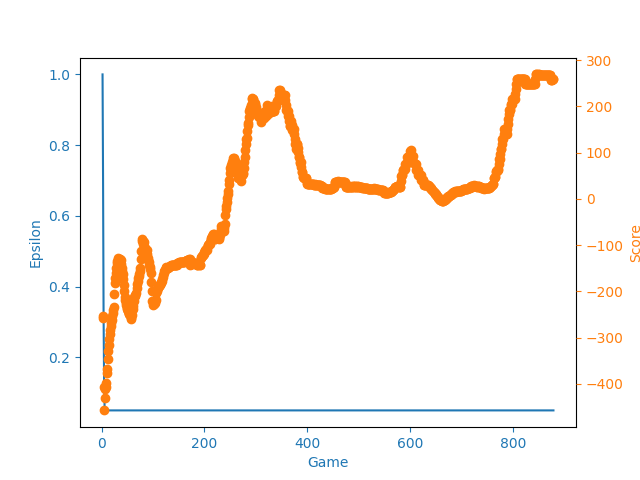
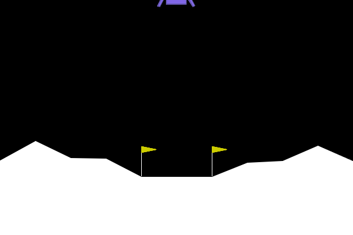
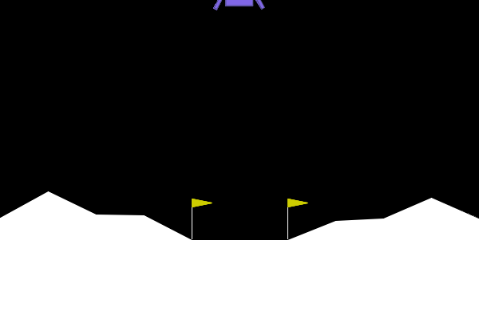

# Space Lander DQN Agent

## Description

DQN agent for the Space Lander environment.

It uses a simple neural network with 2 hidden layers of 64 neurons each.
Code written in PyTorch and Python 3.10.0

Can be run with provided dockerfile or with image: `ghcr.io/KacperMalachowski/QLearning:main`

## Installation

```bash
pip install -r requirements.txt
```

## Usage

```bash
python main.py
```

## Results

### Training



### Testing
Best model:


Worst model:



